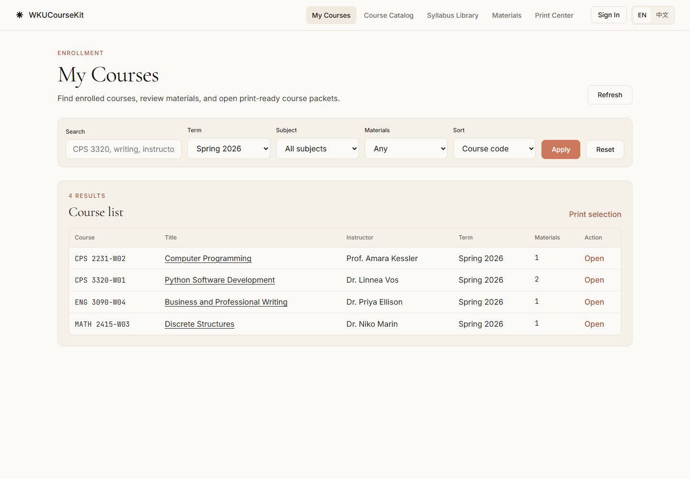
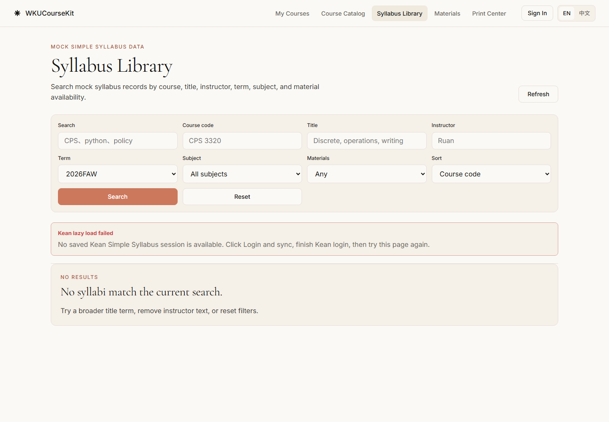
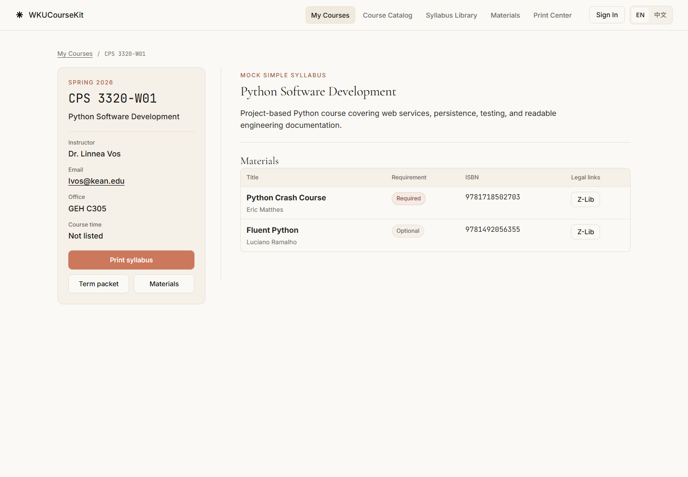
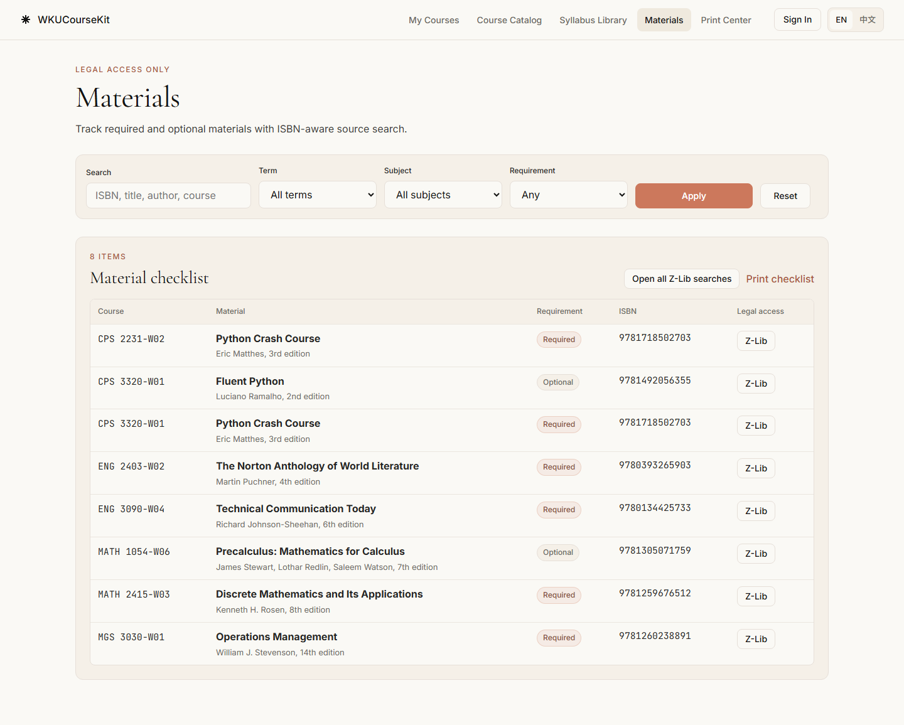
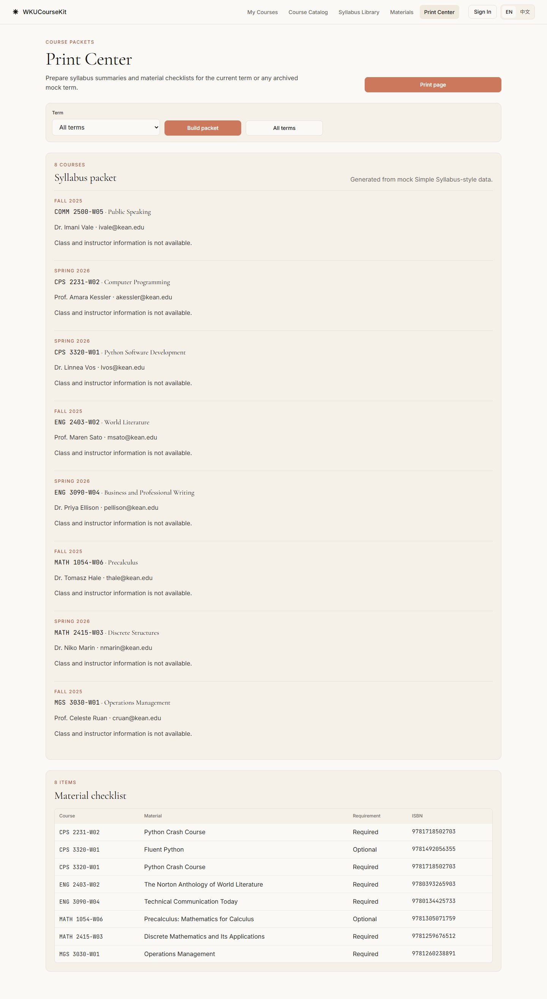

<a id="readme-top"></a>

<div align="center">

# WKUCourseKit

**在本地统一整理课程、教学大纲与学习材料。**

面向温州肯恩大学 / 肯恩大学学生的 Python 网页应用，CPS 3320 课程期末项目。

[English](README.md) · [快速开始](#快速开始) · [反馈问题](https://github.com/xuzihao723/WKU-courseKit/issues)

</div>



## 项目介绍

WKUCourseKit 将课程信息、教学大纲、教材 ISBN 和打印材料包集中到一个本地网站中。FastAPI 处理请求，Jinja2 生成页面，SQLAlchemy 将数据保存在 SQLite 中。

项目附带演示数据，无需大学账号即可体验核心功能。GitHub 用于托管源码和项目成果；下载后需要在自己的电脑上启动 Python 服务。本项目是课程作业，不是学校官方服务。

## 功能

| 页面 | 功能 |
| --- | --- |
| 我的课程 | 按关键词、学期、学科和材料情况筛选课程，查看课程详情。 |
| 教学大纲库 | 根据课程代码、标题、教师等条件搜索本地或已导入记录。 |
| 课程详情 | 查看教学大纲章节、教师信息及课程材料。 |
| 学习材料 | 查看必需/可选教材、ISBN、已有状态和图书馆/书店链接。 |
| 打印中心 | 按学期生成课程材料包与教材清单，使用浏览器打印或另存为 PDF。 |
| 课程目录 | 查询外部 Kean 课程目录，目前指定为温州校区 2026 秋季学期。 |
| 双语界面 | 切换英文和中文界面。 |

<details>
<summary>查看更多截图</summary>









</details>

## 快速开始

已验证环境：**Windows + Python 3.11.9**。无需 Node.js 或独立数据库服务。

在 PowerShell 中执行：

```powershell
git clone https://github.com/xuzihao723/WKU-courseKit.git
cd WKU-courseKit\WKUCourseKit_Final_Project\Code

py -3.11 -m venv .venv
.\.venv\Scripts\python.exe -m pip install -r requirements.txt
.\.venv\Scripts\python.exe -m uvicorn app.main:app --host 127.0.0.1 --port 8000
```

没有 Git 时可通过仓库的 **Code → Download ZIP** 下载，解压后进入 `WKUCourseKit_Final_Project\Code`，从创建虚拟环境的命令开始执行。如果没有 `py`，确认 `python --version` 后使用 `python -m venv .venv`。

访问 **[http://127.0.0.1:8000](http://127.0.0.1:8000)**。数据库为空时，启动流程会自动导入演示数据，不需要先配置 `.env` 或登录学校账号。按 **Ctrl+C** 停止服务。开发时可在启动命令末尾添加 `--reload`。

macOS/Linux 对应命令见 [English README](README.md#getting-started)，本次未在这些系统上验证。

## 使用方式

1. 在“我的课程”搜索 `CPS 3320`。
2. 点击课程标题，查看教学大纲和材料。
3. 在“学习材料”查看 ISBN 和外部来源链接。
4. 在“打印中心”选择学期，点击打印；也可在浏览器打印对话框中保存 PDF。
5. 点击导航中的 **EN / 中文** 切换界面。

健康检查地址：[http://127.0.0.1:8000/health](http://127.0.0.1:8000/health)。正常响应为：

```json
{"status":"ok","database":"connected"}
```

## 数据与可选导入

演示数据包含 **2 个学期、8 位教师、8 门课程、8 份教学大纲、21 个大纲章节和 7 项材料**。详情见 [数据集说明](WKUCourseKit_Final_Project/Dataset/DATASET.md)。

需要恢复演示数据时，在 `Code` 目录执行：

```powershell
.\.venv\Scripts\python.exe scripts\seed_db.py
```

**此命令会清空已有应用记录再导入演示数据。** 如果已经导入个人课程，请先停止服务并备份 `wkcoursekit.db`。

可选的 Simple Syllabus 导入命令：

```powershell
.\.venv\Scripts\python.exe -m playwright install chromium
.\.venv\Scripts\python.exe scripts\sync_simple_syllabus.py
```

请在脚本打开的学校官方页面中自行登录。该流程可能替换现有记录，应先备份数据库。应用不在自己的页面收集学校密码，但会在本地保存会话令牌、Cookie 或浏览器状态；这些文件、`.env`、数据库和缓存已被 `.gitignore` 排除。

学校账号登录及同步流程尚未完成实测，需要有效的学校访问权限和网络连接。体验演示数据不需要执行此步骤。

## 运行检查

本次检查通过了：

- 依赖一致性检查和 23 个 Python 源文件的语法解析。
- 现有数据库副本与演示数据环境下，共 42 次核心页面、接口及中英文页面检查。
- Chromium 中五个核心页面的显示、课程搜索提交、中文界面和打印按钮处理函数检查，未出现 JavaScript 页面错误。
- 额外的课程目录请求，返回 HTTP 200 和结果列表。

完整范围及限制见 [验证记录](docs/VERIFICATION.md)。外部目录的实时性、学校登录同步、课表规划及日历导出不属于已完成的端到端验证范围。项目按本地单用户模式运行，不包含经过验证的多人生产部署方案。

GitHub Pages 只能托管静态网站，不能直接运行本项目的 FastAPI 和 SQLite 后端；本仓库用于下载后本地运行。

## 项目文件

| 路径 | 内容 |
| --- | --- |
| `WKUCourseKit_Final_Project/Code/` | 应用源码、模板、样式、运行数据与脚本。 |
| `WKUCourseKit_Final_Project/Dataset/` | 演示数据副本和说明。 |
| `WKUCourseKit_Final_Project/Results/` | 原始项目截图及结果说明。 |
| `docs/images/` | 本次用演示数据生成的界面截图。 |
| `docs/VERIFICATION.md` | 运行验证范围与结果。 |

[项目报告 PDF](WKUCourseKit_Final_Project/Report%20PDF/WKUCourseKit_Final_Report.pdf) · [演示文稿 PPTX](WKUCourseKit_Final_Project/Presentation%20Slides/WKUCourseKit_Final_Presentation.pptx)

## 常见问题

- **提示找不到模块或 uvicorn**：使用上面的 `.venv\Scripts\python.exe` 安装和启动，避免混用系统 Python。
- **无法导入 app.main**：先进入 `WKUCourseKit_Final_Project\Code`。
- **8000 端口被占用**：将启动命令中的端口改为 `8001`，浏览器也改为访问对应端口。
- **列表为空**：先清除关键词、学期及学科筛选条件，再决定是否重置演示数据。
- **外部课程目录无法访问**：检查网络；本地演示页面仍可使用。

## 参与与许可

欢迎通过 [Issues](https://github.com/xuzihao723/WKU-courseKit/issues) 提交可复现问题或建议，附上操作系统、Python 版本、启动命令和问题页面。不要提交登录会话或个人敏感日志。

项目目前没有提供许可证文件，未声明开源许可；如需复用，请联系维护者 [@xuzihao723](https://github.com/xuzihao723)。

README 组织方式参考 [awesome-readme](https://github.com/matiassingers/awesome-readme) 与 [Best-README-Template](https://github.com/othneildrew/Best-README-Template)。

<p align="right"><a href="#readme-top">返回顶部</a></p>
